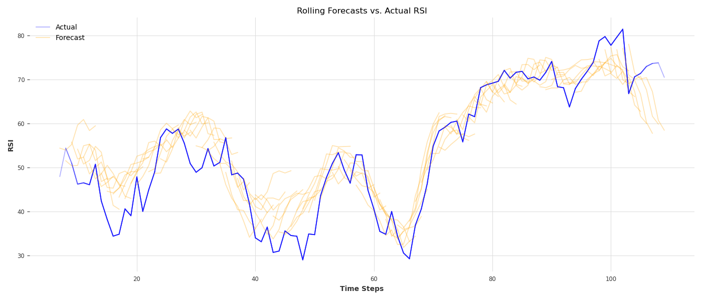
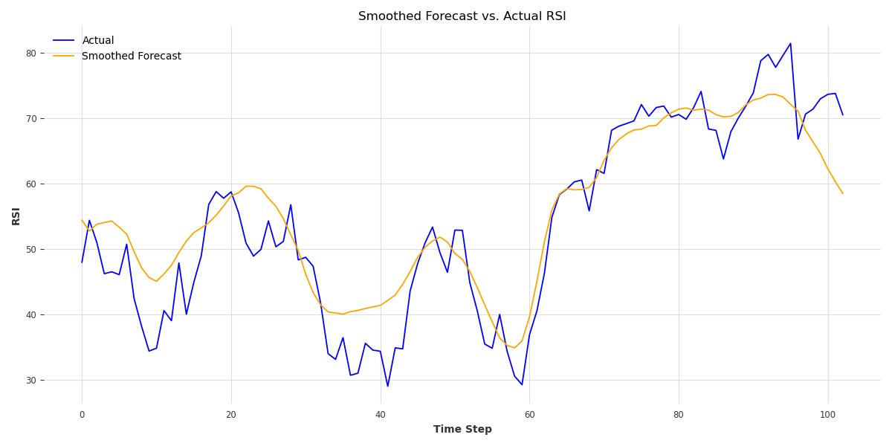
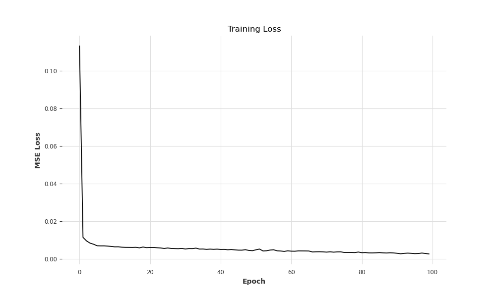

# Deep Learning Time-Series Forecasting: Extrapolating RSI with N-BEATS

[](https://www.python.org/)
[](https://pytorch.org/)
[](https://github.com/MisguidedTrooper/NBEATS-RSI-Forecasting)

> **BSc Final Year Dissertation Project**  
> *Title:* "Evaluating the Effectiveness of Applying Machine Learning to Extrapolate Technical Indicators for Stock Trading Algorithms"  
> *Author:* **Parvesh** — BSc Computer Science with Mathematics (Joint Honours), University of Leeds

---

## 📌 Project Overview

Quantitative trading algorithms traditionally evaluate technical indicators such as the **Relative Strength Index (RSI)** using historical price action to signal overbought or oversold market regimes. However, reactive indicators lag during rapid regime shifts.

This research investigates whether deep neural time-series architectures—specifically **N-BEATS (Neural Basis Expansion Analysis for Interpretable Time Series Forecasting)**—can accurately extrapolate future RSI indicator trajectories on US equities (NYSE / NASDAQ), providing predictive forward bounds for algorithmic execution and multi-stage trading pipelines.

              ┌───────────────────────────────────────────────────────────┐
              │                      yFinance Pipeline                    │
              │   Historical US Equities OHLCV Data (e.g., AAPL / S&P)   │
              └─────────────────────────────┬─────────────────────────────┘
                                            │
                                            ▼
              ┌───────────────────────────────────────────────────────────┐
              │              Feature Engineering & Indicator              │
              │             14-Day Wilder's Smoothed RSI Metric           │
              └─────────────────────────────┬─────────────────────────────┘
                                            │
                                            ▼
              ┌───────────────────────────────────────────────────────────┐
              │             N-BEATS Deep Architecture (PyTorch)           │
              │   Backcast / Forecast Stacks with Basis Expansion Blocks  │
              └─────────────────────────────┬─────────────────────────────┘
                                            │
                                            ▼
              ┌───────────────────────────────────────────────────────────┐
              │               Evaluation & Validation Outputs             │
              │   Rolling Multi-Horizon Forecasts vs. Real-World Regimes  │
              └───────────────────────────────────────────────────────────┘

---

## 🔬 Core Methodology & Architecture

1. **Indicator Engineering:**
   * Computed 14-day standard Relative Strength Index values from adjusted closing price data:
     $$\text{RSI} = 100 - \left( \frac{100}{1 + \text{RS}} \right), \quad \text{where } \text{RS} = \frac{\text{Smoothed Average Gain}}{\text{Smoothed Average Loss}}$$
   * Normalised sequential windows for multi-horizon backcasting and forecasting.

2. **N-BEATS Deep Architecture:**
   * Pure deep learning time-series architecture operating directly on sequential time windows without recurrence (no RNN/LSTM) or attention mechanisms.
   * Leveraged hierarchical doubly-residual stacking where each block predicts a **backcast** (reconstructing input to remove explained variance) and a **forecast** (projecting future steps).

3. **Data & Pipeline Pipeline:**
   * Trained and validated on long-range historical US market equity data streamed via `yFinance`.
   * Evaluated rolling multi-step lookahead windows against out-of-sample real-world market movements.

---

## 📊 Key Findings & Empirical Results

| Metric / Attribute | Training Set Performance | Out-of-Sample Test Set Performance |
|---|---|---|
| **Explained Variance ($R^2$)** | **99.1%** | **57.4%** |
| **Mean Absolute Error (MAE)** | ~0.8 RSI Points | **5.6 RSI Points** |
| **Trend & Cycle Capture** | Near-perfect alignment on rolling cyclic trends | Captures primary macro inflections; lags on high-impact news shocks |

### Primary Conclusions
* **Macro Regime Tracking:** N-BEATS demonstrated strong general trend-tracking capabilities, successfully anticipating standard mean-reversion curves and momentum build-ups.
* **Exogenous Shock Sensitivity:** Model degradation on unseen data primarily occurred during high-volatility spike regimes driven by real-world news and fundamental macro announcements—regimes where price action decouples from pure historical technical sequences.
* **Algorithmic Utility:** While purely autoregressive technical extrapolation is insufficient as a standalone execution signal, an average error of **5.6 RSI points** makes the model an effective input feature when combined with fundamental data and multi-modal pipelines (e.g., hybrid LSTM/Transformer trading systems).

---

## 📈 Visualisations & Outputs

### 1. Multi-Step Rolling Forecast vs. Ground Truth


### 2. Smoothed Trajectory Tracking


### 3. Convergence & Training Loss


---

## 🛠 Tech Stack & Tools

- **Languages & Frameworks:** Python 3.x, PyTorch
- **Time-Series & Numerical Computing:** NumPy, Pandas, SciPy
- **Financial APIs:** `yFinance`
- **Visualisation:** Matplotlib, Seaborn
- **Development Environment:** Jupyter Notebooks, PyTorch CUDA

---

## 📂 Repository Structure

```text
NBEATS-RSI-Forecasting/
├── nBeatsRSI/
│   ├── data.ipynb                   # End-to-end exploratory analysis and data extraction
│   ├── data.py                      # Data ingestion and RSI computation pipeline
│   ├── train_rsi.py                 # PyTorch N-BEATS model definition & training loop
│   ├── testrsi.py                   # Out-of-sample evaluation and backtesting harness
│   ├── nbeats_rsi_model.pth         # Trained PyTorch model checkpoint (General RSI)
│   ├── rolling_forecasts.png        # Rolling multi-horizon prediction curves
│   ├── rsi_forecast.png             # Target forecast evaluation visualisations
│   ├── smooth_forecast_vs_actual.png# Smoothed trend tracking comparisons
│   └── training_loss.png            # Loss convergence curves
├── nbeats_AAPL.pth                  # Equity-specific trained weights (AAPL)
└── README.md
## 🚀 Getting Started
1. Clone the Repository
Bash
git clone [https://github.com/MisguidedTrooper/NBEATS-RSI-Forecasting.git](https://github.com/MisguidedTrooper/NBEATS-RSI-Forecasting.git)
cd NBEATS-RSI-Forecasting/nBeatsRSI
2. Set Up Virtual Environment & Dependencies
Bash
python3 -m venv venv
source venv/bin/activate  # On Windows: venv\Scripts\activate
pip install torch numpy pandas yfinance matplotlib seaborn jupyter
3. Run Inference / Evaluation
To evaluate the pre-trained model on recent market data:

Bash
python testrsi.py
4. Train from Scratch
Bash
python train_rsi.py
👤 Author
Parvesh — BSc Computer Science with Mathematics, University of Leeds

GitHub: @MisguidedTrooper
